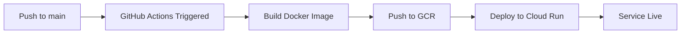

# GitHub Actions Automatic Deployment Setup

This guide will set up automatic deployment to Google Cloud Run whenever you push to the `main` branch.

## Overview

Once set up, every time you push code to GitHub:
1. GitHub Actions automatically builds your Docker image
2. Pushes it to Google Container Registry
3. Deploys to Cloud Run (takes ~2-3 minutes)
4. No manual intervention needed!

---

## Step 1: Create Google Cloud Service Account

A service account allows GitHub Actions to deploy to your GCP project.

### 1.1 Create the Service Account

```bash
gcloud iam service-accounts create github-actions-deployer \
  --display-name="GitHub Actions Deployer" \
  --description="Service account for GitHub Actions to deploy to Cloud Run"
```

### 1.2 Grant Required Permissions

```bash
# Get your project ID
gcloud config get-value project

# Set PROJECT_ID variable (replace with your actual project ID)
export PROJECT_ID="kb-standalone-backend"

# Grant Cloud Run Admin role
gcloud projects add-iam-policy-binding $PROJECT_ID \
  --member="serviceAccount:github-actions-deployer@${PROJECT_ID}.iam.gserviceaccount.com" \
  --role="roles/run.admin"

# Grant Service Account User role (required to deploy)
gcloud projects add-iam-policy-binding $PROJECT_ID \
  --member="serviceAccount:github-actions-deployer@${PROJECT_ID}.iam.gserviceaccount.com" \
  --role="roles/iam.serviceAccountUser"

# Grant Storage Admin (for Container Registry)
gcloud projects add-iam-policy-binding $PROJECT_ID \
  --member="serviceAccount:github-actions-deployer@${PROJECT_ID}.iam.gserviceaccount.com" \
  --role="roles/storage.admin"

# Grant Artifact Registry Writer (if using Artifact Registry)
gcloud projects add-iam-policy-binding $PROJECT_ID \
  --member="serviceAccount:github-actions-deployer@${PROJECT_ID}.iam.gserviceaccount.com" \
  --role="roles/artifactregistry.writer"
```

### 1.3 Generate Service Account Key

```bash
gcloud iam service-accounts keys create gcp-key.json \
  --iam-account=github-actions-deployer@${PROJECT_ID}.iam.gserviceaccount.com
```

This creates a file called `gcp-key.json` in your current directory.

**IMPORTANT**: This file contains sensitive credentials. Keep it safe and never commit it to git!

---

## Step 2: Add Secrets to GitHub Repository

### 2.1 Open GitHub Secrets Settings

1. Go to your GitHub repository: https://github.com/illeniall239/DramaGPT
2. Click **Settings** (top right)
3. In the left sidebar, click **Secrets and variables** → **Actions**
4. Click **New repository secret**

### 2.2 Add Required Secrets

Add each of these secrets one by one:

#### Secret 1: `GCP_SA_KEY`
- **Name**: `GCP_SA_KEY`
- **Value**: Open `gcp-key.json` and copy **the entire contents**
- Click **Add secret**

#### Secret 2: `GCP_PROJECT_ID`
- **Name**: `GCP_PROJECT_ID`
- **Value**: Your GCP project ID (e.g., `kb-standalone-backend`)
- Click **Add secret**

#### Secret 3: `SUPABASE_URL`
- **Name**: `SUPABASE_URL`
- **Value**: Your Supabase project URL (e.g., `https://xxxxx.supabase.co`)
- Click **Add secret**

#### Secret 4: `SUPABASE_KEY`
- **Name**: `SUPABASE_KEY`
- **Value**: Your Supabase anon/public key
- Click **Add secret**

#### Secret 5: `SUPABASE_SERVICE_ROLE_KEY`
- **Name**: `SUPABASE_SERVICE_ROLE_KEY`
- **Value**: Your Supabase service role key (from Supabase dashboard)
- Click **Add secret**

#### Secret 6: `GROQ_API_KEY`
- **Name**: `GROQ_API_KEY`
- **Value**: Your Groq API key
- Click **Add secret**

#### Secret 7: `GOOGLE_API_KEY`
- **Name**: `GOOGLE_API_KEY`
- **Value**: Your Google API key for Gemini
- Click **Add secret**

### 2.3 Verify All Secrets Are Added

You should see 7 secrets total:
- GCP_SA_KEY
- GCP_PROJECT_ID
- SUPABASE_URL
- SUPABASE_KEY
- SUPABASE_SERVICE_ROLE_KEY
- GROQ_API_KEY
- GOOGLE_API_KEY

---

## Step 3: Test the GitHub Action

### 3.1 Push the Workflow File to GitHub

```bash
git add .github/workflows/deploy-cloudrun.yml
git commit -m "Add GitHub Actions automatic deployment to Cloud Run"
git push origin main
```

### 3.2 Watch the Deployment

1. Go to your GitHub repository
2. Click the **Actions** tab
3. You should see a workflow run starting
4. Click on the run to see live logs

The deployment will take about **2-3 minutes**.

### 3.3 Verify Deployment

Once the action completes:

```bash
# Get your service URL
gcloud run services describe kb-standalone-backend --region us-central1 --format='value(status.url)'

# Test the endpoint
curl https://YOUR-SERVICE-URL/health
```

Should return:
```json
{"status":"healthy","service":"KB Standalone API"}
```

---

## Step 4: Understanding the Workflow

The GitHub Action triggers automatically when:
- ✅ You push to the `main` branch
- ✅ Changes are made to `backend/` folder
- ✅ Changes are made to `Dockerfile`
- ✅ Changes are made to the workflow file itself

You can also trigger it manually:
1. Go to **Actions** tab
2. Select "Deploy to Google Cloud Run"
3. Click **Run workflow**

---

## How It Works

### Build Process


### What Gets Deployed
- Only files in the `backend/` directory (via Dockerfile)
- Environment variables from GitHub Secrets
- Automatic scaling configuration (0-10 instances)

---

## Troubleshooting

### Issue 1: "Permission Denied" Error

**Error**: `Permission denied when deploying to Cloud Run`

**Solution**: Re-check service account permissions:
```bash
# List current permissions
gcloud projects get-iam-policy $PROJECT_ID \
  --flatten="bindings[].members" \
  --filter="bindings.members:serviceAccount:github-actions-deployer@*"

# If missing roles, re-run the grant commands from Step 1.2
```

### Issue 2: "Cannot push to Container Registry"

**Error**: `denied: Permission "storage.buckets.get" denied`

**Solution**: Enable Container Registry API:
```bash
gcloud services enable containerregistry.googleapis.com
```

### Issue 3: Secrets Not Working

**Problem**: Service deploys but crashes due to missing env vars

**Check**:
1. Go to GitHub repo → Settings → Secrets and variables → Actions
2. Verify all 7 secrets are present
3. Secrets are case-sensitive! Make sure they match exactly

**Re-deploy manually to update env vars**:
```bash
gcloud run services update kb-standalone-backend \
  --region us-central1 \
  --update-env-vars="SUPABASE_URL=YOUR-VALUE,..."
```

### Issue 4: Action Fails on First Run

**Common on first deployment**

**Solution**: Enable required APIs:
```bash
gcloud services enable run.googleapis.com
gcloud services enable cloudbuild.googleapis.com
gcloud services enable containerregistry.googleapis.com
```

Then re-run the action (Actions tab → Re-run all jobs).

### Issue 5: Slow Deployments

**If builds take >5 minutes**

**Solution**: Use Cloud Build caching (already configured in workflow)

The workflow uses Docker layer caching, so subsequent builds are much faster (30s-1min).

---

## Viewing Logs

### GitHub Actions Logs
1. Go to **Actions** tab in GitHub
2. Click on any workflow run
3. Click on the "deploy" job
4. Expand any step to see detailed logs

### Cloud Run Logs
```bash
# View recent logs
gcloud run services logs read kb-standalone-backend \
  --region us-central1 \
  --limit 100

# Tail logs (live)
gcloud run services logs tail kb-standalone-backend \
  --region us-central1
```

---

## Security Best Practices

1. **Never commit `gcp-key.json`** to your repository
2. **Delete the local key file** after adding to GitHub:
   ```bash
   rm gcp-key.json
   ```
3. **Rotate service account keys** every 90 days:
   ```bash
   # List existing keys
   gcloud iam service-accounts keys list \
     --iam-account=github-actions-deployer@${PROJECT_ID}.iam.gserviceaccount.com

   # Delete old key
   gcloud iam service-accounts keys delete KEY_ID \
     --iam-account=github-actions-deployer@${PROJECT_ID}.iam.gserviceaccount.com

   # Create new key
   gcloud iam service-accounts keys create gcp-key-new.json \
     --iam-account=github-actions-deployer@${PROJECT_ID}.iam.gserviceaccount.com
   ```
4. **Use GitHub Environments** (optional) for production deployments with approval gates

---

## Cost Impact

GitHub Actions free tier:
- **2,000 minutes/month** for private repos
- **Unlimited** for public repos

Each deployment uses ~2-3 minutes, so you can deploy:
- **~600 times/month** on free tier (private repo)
- **Unlimited** (public repo)

---

## Disabling Auto-Deployment

If you want to temporarily disable auto-deployment:

### Option 1: Disable the Workflow
1. Go to **Actions** tab
2. Click "Deploy to Google Cloud Run" on the left
3. Click the "..." menu → **Disable workflow**

### Option 2: Remove the Workflow File
```bash
git rm .github/workflows/deploy-cloudrun.yml
git commit -m "Disable auto-deployment"
git push
```

---

## Advanced Configuration

### Deploy to Multiple Regions

Modify `.github/workflows/deploy-cloudrun.yml` to deploy to multiple regions:

```yaml
- name: Deploy to Cloud Run (us-central1)
  run: |
    gcloud run deploy $SERVICE_NAME \
      --image gcr.io/$PROJECT_ID/$SERVICE_NAME:$GITHUB_SHA \
      --region us-central1 \
      ...

- name: Deploy to Cloud Run (europe-west1)
  run: |
    gcloud run deploy $SERVICE_NAME \
      --image gcr.io/$PROJECT_ID/$SERVICE_NAME:$GITHUB_SHA \
      --region europe-west1 \
      ...
```

### Deploy Only on Release Tags

Change the trigger in the workflow file:

```yaml
on:
  push:
    tags:
      - 'v*.*.*'  # Only deploy on version tags like v1.0.0
```

Then deploy with:
```bash
git tag v1.0.0
git push origin v1.0.0
```

### Add Slack Notifications

Add this step at the end of the workflow:

```yaml
- name: Notify Slack
  if: always()
  uses: 8398a7/action-slack@v3
  with:
    status: ${{ job.status }}
    webhook_url: ${{ secrets.SLACK_WEBHOOK }}
```

---

## Next Steps

After successful setup:

1. ✅ Make a small change to `backend/main.py`
2. ✅ Commit and push to GitHub
3. ✅ Watch it deploy automatically in the Actions tab
4. ✅ Verify the change is live on your Cloud Run URL

**You're now set up for continuous deployment!** 🚀

Every push to `main` will automatically deploy to production.

---

## Comparison: Manual vs Automated

| Aspect | Manual Deployment | GitHub Actions |
|--------|-------------------|----------------|
| **Time** | 5-10 minutes | 2-3 minutes |
| **Effort** | Run commands manually | Just `git push` |
| **Consistency** | Can forget steps | Always the same |
| **Rollback** | Manual commands | Re-run previous action |
| **History** | Git commits only | Full deployment logs |
| **Team** | Need GCP access | Just push to GitHub |

---

## Support

**GitHub Actions Documentation**: https://docs.github.com/en/actions
**Cloud Run Documentation**: https://cloud.google.com/run/docs
**Troubleshooting**: Check the logs in the Actions tab for detailed error messages

**Happy deploying!** 🎉
